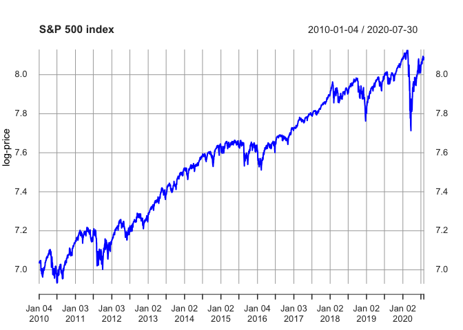
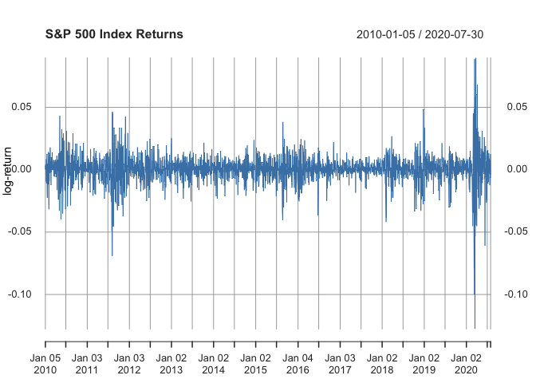
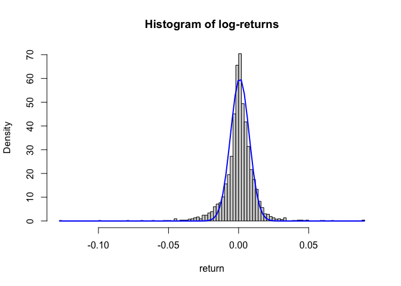
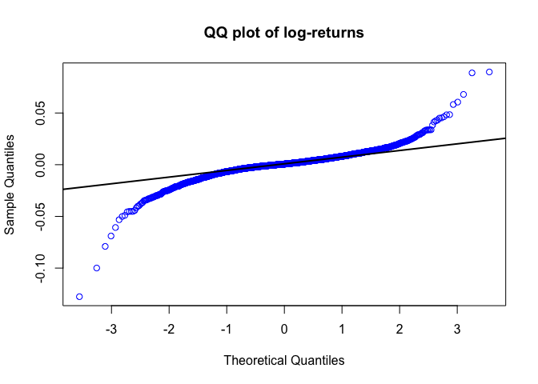
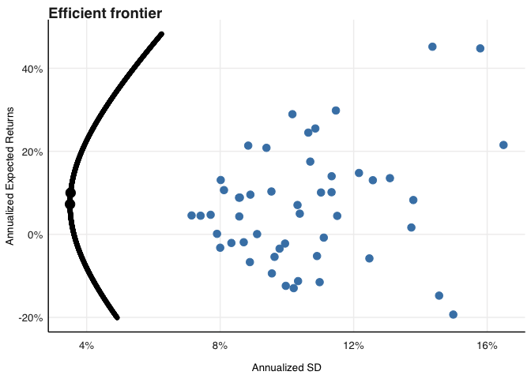

# Purpose

This serves as my notebook for the third practical for financial
econometrics. Today we are looking at portfolio optimization using both
linear and quadratic solvers.

The link for the practical class is
\url\[<https://www.youtube.com/watch?v=7u_kLDcFk94>\]

``` r
rm(list = ls()) # Clean your environment:
gc() # garbage collection - It can be useful to call gc after a large object has been removed, as this may prompt R to return memory to the operating system.
```

    ##          used (Mb) gc trigger (Mb) limit (Mb) max used (Mb)
    ## Ncells 464982 24.9     993868 53.1         NA   669302 35.8
    ## Vcells 871215  6.7    8388608 64.0      16384  1840208 14.1

``` r
library(tidyverse)
```

    ## ── Attaching packages ─────────────────────────────────────── tidyverse 1.3.2 ──
    ## ✔ ggplot2 3.4.0     ✔ purrr   1.0.2
    ## ✔ tibble  3.2.1     ✔ dplyr   1.1.2
    ## ✔ tidyr   1.3.0     ✔ stringr 1.5.0
    ## ✔ readr   2.1.4     ✔ forcats 0.5.2
    ## ── Conflicts ────────────────────────────────────────── tidyverse_conflicts() ──
    ## ✖ dplyr::filter() masks stats::filter()
    ## ✖ dplyr::lag()    masks stats::lag()

``` r
list.files('code/', full.names = T, recursive = T) %>% .[grepl('.R', .)] %>% as.list() %>% walk(~source(.))
```

#Portfolio Optimization In this section we cover portfolio
optimization - I thought it would be useful to add it this year as it is
becoming more and more important today and might spur some interests in
project applications.

While the list of possible optimizers to explore in R is vast, we will
be focussing on setting up a simple optimization problem and covering
this topic at a comparatively high level.

<https://cran.r-project.org/web/views/Optimization.html>

Below we will do a basic overview of available portfolio optimization
techniques in R.

The purpose of doing portfolio optimization is to find some optimal
strategy conditional upon some predefined target.

There are various types of optimizations, including e.g. a linear
programming exercise of the following form:

Maximize: cT.x Subject to: Ax<b
 and: x>=0

From the above, x would, in a portfolio optimization setting, represent
a vector of weights, with c and b known vectors, and A a matrix of
coefficients. cT.x is the objective function, with the inequalities the
constraints over which the objective is maximized. Let’s translate this
into intuitive terms: we simply want to find the weights, w , which
maximize expected returns, while being subject to specific constraints.

George Dantzig’s celebrated work on linear programming resulted in the
simplex form solution which makes solving these optimizers easy.

From Wikipedia: In mathematical optimization, Dantzig’s simplex
algorithm (or simplex method) is a popular algorithm for linear
programming.\[1\]

The name of the algorithm is derived from the concept of a simplex and
was suggested by T. S. Motzkin.\[2\] Simplices are not actually used in
the method, but one interpretation of it is that it operates on
simplicial cones, and these become proper simplices with an additional
constraint. The simplicial cones in question are the corners (i.e., the
neighborhoods of the vertices) of a geometric object called a polytope.
The shape of this polytope is defined by the constraints applied to the
objective function.

##MVO (Mean Variance Optimizer) A common example is a mean-variance
optimizer (MVO, of the Markowitzian type), where the idea is to find a
weights vector which maximizes return(μ ), while minimizing risk (σ , or
the covariance matrix). This is a quadratic type optimization.
Additionally, we may add various other box (e.g. long-only, or weight \>
0) and group constraints (e.g. max exposure to single sector of 20%, and
max single stock exposure of 10%) too.

Thus: MVO is a quadratic problem with linear constraints.

We can frame this problem as:

From the above - we find the weights vector, w, which minimize the
sample covariance matrix (Σ̂ ), subject to the constraints that wT∗1=1,
or that the sum of the weights equal one (i.e, fully invested capital).
The target return, r¯, is expressed such that it equates the
m-dimensional vector of expected returns of the assets.

The solution we arrive at is unique, and can thus be labeled as the
MV-optimized portfolio weights.

Of course the accuracy of this out-of-sample depends on various factors,
including the quality of return forecasts and stability of the
covariance matrix. Nonetheless, the solution is pareto efficient
in-sample.

Contrasting in-sample (IS) efficiency with out-of-sample (OOS)
inaccuracy is a fun past-time enjoyed by many a scholar.

Further, MVO is part of the subjective optimization model suite -
i.e. where a required return level is provided. Another common example
includes portfolio utility optimization, where an explicit risk
preference (typically called λ) is provided and incorporated into the
optimization as:

MaxUP=E(RP)−λi∗σp

For the above, the level of risk is given and return and risk optimized
around it. See below for several different levels of risk on 10 stocks
that I randomly constructed and optimized using the above framework, and
linear constraints of long only (w\>0 ) and full investment (∑wi=1 ):

### Notes

Port (Balanced) have restrictions-\> weights risk prefenrences plug into
optimizer

mean variance frontier (We want port to be on the frontier) although
optimizer may choose something inside the frontier (hold inferior asset
(mean to SD)) the “inferior” asset may have a different covariance
relationship with other assets

lambda is your risk preference and can be set

<figure>

<figcaption aria-hidden="true">Frontier</figcaption>
</figure>


Objective optimization techniques include: minimum variance (MV), max
return or max Sharpe portfolios, which are comparatively easy to
calculate and apply irrespective of risk or return preference (hence,
objective optimal point - not subjectively determined by preferred level
of risk).

## Implementing quadratic programming in R

We will next test some optimization techniques on German stock market
data using R’s quadprog package.

Before testing the MVO optimization routine, let’s first learn the
notation used in quadprog:

solve.QP(Dmat, dvec, Amat, bvec, meq)

So we have:

minimize: 12wT∗Dmat∗w−dvecTw

s.t.: AmatT∗w\>=bvec

with:

Dmat: matrix to be minimized (typically sample covariance matrix)

dvec: vector in quadratic function below to be minimized (expected
returns vector for MVO, where we minimize negative returns, which is
akin to maximizing returns).

Amat: matrix of constraints to be respected when minimizing quadratic
function

bvec: b0 matrix (discussed later)

meq: first meq constraints are equality constraints (otherwise
inequality) - defaults to zero, i.e. all are inequality.

The complicated part of programming the above is planning the
constraints matrix (the optimize part could be as simple as the sample
covariance matrix and past returns vector, although some shrinkage would
probably be appleid to Σ ).

E.g., if we have 3 stocks, and we want to make them sum to 1 (i.e. be
fully invested), as well as have the maximum weight to any stock be 50%
and minimum weight be 10% (box constraint), we set the Amat and bvec as
follows (multiply the following out to understand how we use meq as
well):

We then need to set meq = 1: as we require w1 + w2 + w3 = 1, while -w1
\> -0.5 (i.e. w1 \< 0.5) and w1 \> 0.1 is required for the others (they
are inequality).

The reason for the minusses above is that the optimization is always
framed as a larger than sign.

So… let’s go do this on some real data so that you can brag to your
friends at your next braai.

### Pracically

you have

equities:A and B fixed income C, D abd G

constraint equity exposure of 60%

\|1\| \|1\|  
\|0\| \* w \>= 60% \|0\| \|0\|

\# Optimizer: Covariance Estimator and returns vector We will be using
the RiskPortfolios portfolio to estimate our sample covariance matrix.
We will also take a look at the fitHeavyTail package for more extensions
to our covariance matrix.

``` r
pacman::p_load(tidyverse)
pacman::p_load(RiskPortfolios);pacman::p_load(fitHeavyTail)


#Let's load some real data
pacman::p_load(tidyverse);pacman::p_load(quadprog)
StartDate <- lubridate::ymd(20150101)
Dax <- fmxdat::DAX %>% filter(date > StartDate)

# Let's now pick and only use the top 50 stocks from the last date:
Top_50 <- 
  Dax %>% filter(date == last(date)) %>% 
  arrange(desc(weight)) %>% top_n(50, weight) %>% pull(Tickers)

# Right, with this let's subset our entire dataframe:
Dax <- 
  Dax %>% filter(Tickers %in% Top_50)
```

Now for calculating a covariace matrix usinf RiskPorfolios (or other
packages )- you will find that we hace to spread the data

we need a full matrix for a covariance matrix therefore we need to make
assumptions about the NAs to account for this

``` r
return_mat <- Dax %>% select(date, Tickers, return) %>% spread(Tickers, return)

# Notice here - I do not spread with Sectors and weights in the df... 
# This follows as it would create tons of duplicates - as the sectors and weights are now not assigned tidily, but effectively repeated for all stocks..
# Please check this yourself and be careful when gathering / spreading...
```

##Square Matrix

The first problem that you will encounter is having a square data
matrix. Mostly stocks enter and exit an index at odd intervals
(delisting, listing, etc) - implying they don’t have similar start and
end dates.

Naturally, as you want to calculate a covariance matrix - this would
require a full square matrix of returns, as NA values cannot be
tolerated.

There are several ways to deal with this (I list good and bad and
absolute no-nos below):

1)Force a square matrix by only considering stocks that have returns for
the full period. This is not a great option as you would lose a lot of
information

2)Set NA to zero This is a massive no-no, as zero is a valid return
(flat price) and would thus bias your covariance estimate

3)Use average returns for that period Plausible solution, but the
problem is now that you bias the distribution of that stock to the
market - thereby potentially bidding up its covariance with other
stocks.

4)Create random draws based on a sample distribution for the stock
Better solution - as it preserves the distributional elements particular
to the stock.

Could also use peer distribution (e.g. sector) as well. What this means
is that you calculate a distribution and then bootstap the missing data
and therefore distributional the data is consisten but of course need to
account for market conditions

### Distributional draws to make returns maatrix square

Right, let’s use step 4 above to fill our missing data using a function
that we create (doubling as an exercise in function creator too).

Note first my use of Seed - this is the randomness specifyer. I like to
make my seed something really random, like the exact time, e.g.

ALSO note (NB):

Whenever we use mutate to get an answer that does not produce a singular
answer (like e.g. producing an object), we need to place it in a list
environment. An example of this would be if you try to calculate the
t.test for a group using mutate. See for yourself the following won’t
work:

``` r
# mtcars %>% group_by(gear) %>% mutate(ttest = stats::t.test(mpg))
```

But the following will

``` r
tresult <- mtcars %>% group_by(gear) %>% mutate(ttest = list(stats::t.test(mpg)))
print(tresult)
```

    ## # A tibble: 32 × 12
    ## # Groups:   gear [3]
    ##      mpg   cyl  disp    hp  drat    wt  qsec    vs    am  gear  carb ttest  
    ##    <dbl> <dbl> <dbl> <dbl> <dbl> <dbl> <dbl> <dbl> <dbl> <dbl> <dbl> <list> 
    ##  1  21       6  160    110  3.9   2.62  16.5     0     1     4     4 <htest>
    ##  2  21       6  160    110  3.9   2.88  17.0     0     1     4     4 <htest>
    ##  3  22.8     4  108     93  3.85  2.32  18.6     1     1     4     1 <htest>
    ##  4  21.4     6  258    110  3.08  3.22  19.4     1     0     3     1 <htest>
    ##  5  18.7     8  360    175  3.15  3.44  17.0     0     0     3     2 <htest>
    ##  6  18.1     6  225    105  2.76  3.46  20.2     1     0     3     1 <htest>
    ##  7  14.3     8  360    245  3.21  3.57  15.8     0     0     3     4 <htest>
    ##  8  24.4     4  147.    62  3.69  3.19  20       1     0     4     2 <htest>
    ##  9  22.8     4  141.    95  3.92  3.15  22.9     1     0     4     2 <htest>
    ## 10  19.2     6  168.   123  3.92  3.44  18.3     1     0     4     4 <htest>
    ## # ℹ 22 more rows

using mutate and the output is not singular then you need to wrap it in
a list using list

``` r
# We can extract the pvalue for all rows as:
tresult %>% mutate(pval = ttest[[1]]$p.value)
```

    ## # A tibble: 32 × 13
    ## # Groups:   gear [3]
    ##      mpg   cyl  disp    hp  drat    wt  qsec    vs    am  gear  carb ttest  
    ##    <dbl> <dbl> <dbl> <dbl> <dbl> <dbl> <dbl> <dbl> <dbl> <dbl> <dbl> <list> 
    ##  1  21       6  160    110  3.9   2.62  16.5     0     1     4     4 <htest>
    ##  2  21       6  160    110  3.9   2.88  17.0     0     1     4     4 <htest>
    ##  3  22.8     4  108     93  3.85  2.32  18.6     1     1     4     1 <htest>
    ##  4  21.4     6  258    110  3.08  3.22  19.4     1     0     3     1 <htest>
    ##  5  18.7     8  360    175  3.15  3.44  17.0     0     0     3     2 <htest>
    ##  6  18.1     6  225    105  2.76  3.46  20.2     1     0     3     1 <htest>
    ##  7  14.3     8  360    245  3.21  3.57  15.8     0     0     3     4 <htest>
    ##  8  24.4     4  147.    62  3.69  3.19  20       1     0     4     2 <htest>
    ##  9  22.8     4  141.    95  3.92  3.15  22.9     1     0     4     2 <htest>
    ## 10  19.2     6  168.   123  3.92  3.44  18.3     1     0     4     4 <htest>
    ## # ℹ 22 more rows
    ## # ℹ 1 more variable: pval <dbl>

Or rather use a map to be consisten but remember this works inside out
but it is tricky but powerful

``` r
# Or alternatively using map as:
tresult %>% mutate(pval = unlist(map(ttest, "p.value")))
```

    ## # A tibble: 32 × 13
    ## # Groups:   gear [3]
    ##      mpg   cyl  disp    hp  drat    wt  qsec    vs    am  gear  carb ttest  
    ##    <dbl> <dbl> <dbl> <dbl> <dbl> <dbl> <dbl> <dbl> <dbl> <dbl> <dbl> <list> 
    ##  1  21       6  160    110  3.9   2.62  16.5     0     1     4     4 <htest>
    ##  2  21       6  160    110  3.9   2.88  17.0     0     1     4     4 <htest>
    ##  3  22.8     4  108     93  3.85  2.32  18.6     1     1     4     1 <htest>
    ##  4  21.4     6  258    110  3.08  3.22  19.4     1     0     3     1 <htest>
    ##  5  18.7     8  360    175  3.15  3.44  17.0     0     0     3     2 <htest>
    ##  6  18.1     6  225    105  2.76  3.46  20.2     1     0     3     1 <htest>
    ##  7  14.3     8  360    245  3.21  3.57  15.8     0     0     3     4 <htest>
    ##  8  24.4     4  147.    62  3.69  3.19  20       1     0     4     2 <htest>
    ##  9  22.8     4  141.    95  3.92  3.15  22.9     1     0     4     2 <htest>
    ## 10  19.2     6  168.   123  3.92  3.44  18.3     1     0     4     4 <htest>
    ## # ℹ 22 more rows
    ## # ℹ 1 more variable: pval <dbl>

Lets go back to the amat that we need to be singular

``` r
# Note I set impute_returns_method to NONE by default. This will produce a warning if there is indeed a missing return in the matrix...

#Note that to use this function the return matrix must be in the format of cols = date, stocks therefor wide
#date must be with a small d
impute_missing_returns <- function(return_mat, impute_returns_method = "NONE"){
  # Make sure we have a date column called date:
  if( !"date" %in% colnames(return_mat) ) stop("No 'date' column provided in return_mat. Try again please.")

  # Note my use of 'any' below...
  # Also note that I 'return' return_mat - which stops the function and returns return_mat.
  if( impute_returns_method %in% c("NONE", "None", "none") ) {
    if( any(is.na(return_mat)) ) warning("There are missing values in the return matrix.. Consider maybe using impute_returns_method = 'Drawn_Distribution_Own' / 'Drawn_Distribution_Collective'")
    return(return_mat)
  }


  if( impute_returns_method  == "Average") {

    return_mat <-
      return_mat %>% gather(Stocks, Returns, -date) %>%
      group_by(date) %>%
      mutate(Avg = mean(Returns, na.rm=T)) %>%
      mutate(Avg = coalesce(Avg, 0)) %>% # date with no returns - set avg to zero
      ungroup() %>%
      mutate(Returns = coalesce(Returns, Avg)) %>% select(-Avg) %>% spread(Stocks, Returns)

    # That is just so much easier when tidy right? See how I gathered and spread again to give back a wide df?
    return(return_mat)
  } else

    if( impute_returns_method  == "Drawn_Distribution_Own") {

      N <- nrow(return_mat)
      return_mat <-
        # DIY: see what density function does
        left_join(return_mat %>% gather(Stocks, Returns, -date),
                  return_mat %>% gather(Stocks, Returns, -date) %>% group_by(Stocks) %>%
                    mutate(Dens = list(density(Returns, na.rm=T))) %>%
                    summarise(set.seed(as.numeric(format( Sys.time(), format = "%s"))/1e3*sample(1:100)[1]), Random_Draws = list(sample(Dens[[1]]$x, N, replace = TRUE, prob=.$Dens[[1]]$y))),
                  by = "Stocks"
        ) %>%  group_by(Stocks) %>%
        # Random draw from sample:
        mutate(Returns = coalesce(Returns, Random_Draws[[1]][row_number()])) %>%
        select(-Random_Draws) %>% ungroup() %>% spread(Stocks, Returns)
      return(return_mat)
    } else

      if( impute_returns_method  == "Drawn_Distribution_Collective") {
        NAll <- nrow(return_mat %>% gather(Stocks, Returns, -date))
        # DIY: see what density function does
        return_mat <-
          bind_cols(
            return_mat %>% gather(Stocks, Returns, -date),
            return_mat %>% gather(Stocks, Returns, -date) %>%
              mutate(Dens = list(density(Returns, na.rm=T))) %>% #The density function here just gives the density attributes of the onject in this case returns
              summarise(set.seed(as.numeric(format( Sys.time(), format = "%s"))/1e3*sample(1:100)[1]), Random_Draws = list(sample(Dens[[1]]$x, NAll, replace = TRUE, prob=.$Dens[[1]]$y))) %>%
              unnest(Random_Draws)
          ) %>%
          mutate(Returns = coalesce(Returns, Random_Draws)) %>% select(-Random_Draws) %>% spread(Stocks, Returns)
        return(return_mat)
      } else

        if( impute_returns_method  == "Zero") {
          warning("This is probably not the best idea but who am I to judge....")
          return_mat[is.na(return_mat)] <- 0
          return(return_mat)
        } else
          stop("Please provide a valid impute_returns_method method. Options include:\n'Average', 'Drawn_Distribution_Own', 'Drawn_Distribution_Collective' and 'Zero'.")

  return_mat

}

# Now we will use this function as follows (after saving and sourcing it of course....):

# As a quick example:

 return_mat_Quick = fmxdat::asisa %>% filter(Funds %in% paste0("Fund_", 1:5)) %>% select(date, Funds, Returns) %>% filter(date > lubridate::ymd(20150101)) %>% spread(Funds, Returns)
 impute_missing_returns(return_mat_Quick, impute_returns_method = "NONE")
```

    ## Warning in impute_missing_returns(return_mat_Quick, impute_returns_method =
    ## "NONE"): There are missing values in the return matrix.. Consider maybe using
    ## impute_returns_method = 'Drawn_Distribution_Own' /
    ## 'Drawn_Distribution_Collective'

    ## # A tibble: 90 × 6
    ##    date          Fund_1  Fund_2   Fund_3   Fund_4    Fund_5
    ##    <date>         <dbl>   <dbl>    <dbl>    <dbl>     <dbl>
    ##  1 2015-01-31  0.00411   0.0107  0.0338  NA        0.000464
    ##  2 2015-02-28  0.0501    0.0209  0.0457  NA        0.0521  
    ##  3 2015-03-31 -0.0182   -0.0352  0.0218  NA        0.00500 
    ##  4 2015-04-30  0.0335    0.0388  0.0290  NA        0.0682  
    ##  5 2015-05-31  0.000094 -0.0211 -0.0201  NA       -0.0432  
    ##  6 2015-06-30 -0.0164   -0.0263 -0.00556 NA       -0.0181  
    ##  7 2015-07-31  0.0576   -0.0132  0.0124  NA       -0.0297  
    ##  8 2015-08-31 -0.00583  -0.0265 -0.0289  -0.0305  -0.0336  
    ##  9 2015-09-30 -0.0317   -0.0307  0.0104   0.00994 -0.0502  
    ## 10 2015-10-31  0.0357    0.0587  0.0631   0.0765   0.0693  
    ## # ℹ 80 more rows

Now lets look at how the different methods work and the outcomes

Average

``` r
 impute_missing_returns(return_mat_Quick, impute_returns_method = "Average")
```

    ## # A tibble: 90 × 6
    ##    date          Fund_1  Fund_2   Fund_3   Fund_4    Fund_5
    ##    <date>         <dbl>   <dbl>    <dbl>    <dbl>     <dbl>
    ##  1 2015-01-31  0.00411   0.0107  0.0338   0.0123   0.000464
    ##  2 2015-02-28  0.0501    0.0209  0.0457   0.0422   0.0521  
    ##  3 2015-03-31 -0.0182   -0.0352  0.0218  -0.00663  0.00500 
    ##  4 2015-04-30  0.0335    0.0388  0.0290   0.0423   0.0682  
    ##  5 2015-05-31  0.000094 -0.0211 -0.0201  -0.0211  -0.0432  
    ##  6 2015-06-30 -0.0164   -0.0263 -0.00556 -0.0166  -0.0181  
    ##  7 2015-07-31  0.0576   -0.0132  0.0124   0.00680 -0.0297  
    ##  8 2015-08-31 -0.00583  -0.0265 -0.0289  -0.0305  -0.0336  
    ##  9 2015-09-30 -0.0317   -0.0307  0.0104   0.00994 -0.0502  
    ## 10 2015-10-31  0.0357    0.0587  0.0631   0.0765   0.0693  
    ## # ℹ 80 more rows

Drawn distribution of the own stock (distribution and therefor
bootstraped return is based only on its own distribution of returns)

``` r
 impute_missing_returns(return_mat_Quick, impute_returns_method = "Drawn_Distribution_Own")
```

    ## # A tibble: 90 × 6
    ##    date          Fund_1  Fund_2   Fund_3    Fund_4    Fund_5
    ##    <date>         <dbl>   <dbl>    <dbl>     <dbl>     <dbl>
    ##  1 2015-01-31  0.00411   0.0107  0.0338   0.0387    0.000464
    ##  2 2015-02-28  0.0501    0.0209  0.0457   0.00691   0.0521  
    ##  3 2015-03-31 -0.0182   -0.0352  0.0218  -0.0218    0.00500 
    ##  4 2015-04-30  0.0335    0.0388  0.0290   0.0379    0.0682  
    ##  5 2015-05-31  0.000094 -0.0211 -0.0201   0.000862 -0.0432  
    ##  6 2015-06-30 -0.0164   -0.0263 -0.00556  0.000106 -0.0181  
    ##  7 2015-07-31  0.0576   -0.0132  0.0124   0.0508   -0.0297  
    ##  8 2015-08-31 -0.00583  -0.0265 -0.0289  -0.0305   -0.0336  
    ##  9 2015-09-30 -0.0317   -0.0307  0.0104   0.00994  -0.0502  
    ## 10 2015-10-31  0.0357    0.0587  0.0631   0.0765    0.0693  
    ## # ℹ 80 more rows

Now the collective distribution such that the bootstapped return is
based on the distribution of of all the stocks in the portfolio

``` r
 impute_missing_returns(return_mat_Quick, impute_returns_method = "Drawn_Distribution_Collective")
```

    ## # A tibble: 90 × 6
    ##    date          Fund_1  Fund_2   Fund_3   Fund_4    Fund_5
    ##    <date>         <dbl>   <dbl>    <dbl>    <dbl>     <dbl>
    ##  1 2015-01-31  0.00411   0.0107  0.0338   0.00969  0.000464
    ##  2 2015-02-28  0.0501    0.0209  0.0457   0.0364   0.0521  
    ##  3 2015-03-31 -0.0182   -0.0352  0.0218  -0.0285   0.00500 
    ##  4 2015-04-30  0.0335    0.0388  0.0290   0.0349   0.0682  
    ##  5 2015-05-31  0.000094 -0.0211 -0.0201   0.0585  -0.0432  
    ##  6 2015-06-30 -0.0164   -0.0263 -0.00556 -0.0124  -0.0181  
    ##  7 2015-07-31  0.0576   -0.0132  0.0124   0.0242  -0.0297  
    ##  8 2015-08-31 -0.00583  -0.0265 -0.0289  -0.0305  -0.0336  
    ##  9 2015-09-30 -0.0317   -0.0307  0.0104   0.00994 -0.0502  
    ## 10 2015-10-31  0.0357    0.0587  0.0631   0.0765   0.0693  
    ## # ℹ 80 more rows

``` r
 # The following should, broadly speaking, be close to one another:
impute_missing_returns(return_mat_Quick, impute_returns_method = "Drawn_Distribution_Own") %>% pull(Fund_4) %>% sd()
```

    ## [1] 0.04064415

``` r
return_mat_Quick %>% pull(Fund_4) %>% sd(., na.rm=T)
```

    ## [1] 0.04166576

``` r
options(scipen = 999) # Stop the scientific notation of
return_mat <- impute_missing_returns(return_mat, impute_returns_method = "Drawn_Distribution_Collective")

# And it is pretty quick too....

# Right! So now we have a square matrix:

any(is.na(return_mat)) # if false then all NAs have been removed
```

    ## [1] FALSE

## Simple Covariance matrix

Let’s get the simplest form of a covariance matrix, and then calculate
the geometric means (remember - for optimizations, it is not correct to
use simple mean vectors… can you argue why?).

``` r
# Drop date column for this...
return_mat_Nodate <- data.matrix(return_mat[, -1])

# Simple Sample covariance and mean:
Sigma <- RiskPortfolios::covEstimation(return_mat_Nodate) # this has to be a (TxN) matrix of returns, therefore the line above just removes the date column and makes it a matrixs not a df
# Simple means (should not be used here):
# Mu <- RiskPortfolios::meanEstimation(return_mat_Nodate)

# Rather use geometric means, which is the actual returns for each stock as opposed to the average:
Mu <- return_mat %>% summarise(across(-date, ~prod(1+.)^(1/n())-1)) %>% purrr::as_vector()
# Notice now that we need to raise to the power of 1/N to make it daily here.
# The important thing is that the periodicity between the mean and sigma is the same. NB!
# Also, purrr::as_vector() just makes a vector out of the Df that can be used downstream

# Btw the above is equivalent to:
# Mu <- return_mat %>% summarise(across(-date, ~exp(mean(log(1+.))) - 1 )) %>% purrr::as_vector()
```

##More Accurate covariance estimations

Let’s digress momentarily on the covariance matrix. There is a long and
interesting literature that has developed highlighting some of the
shortcomings of using a simple covariance matrix as the one above.

First, we know that financial returns data is anything but Gaussian.
E.g., looking at the SP500 returns:

note: when using mutate you need to use cumprod to chain the returns but
when using summarise then its just prod as ordering matters

summarise collapses it using the same formula depending if you want the
final return or the cumulative return at each date

periodicity: covariance and mew must be the same this comes from the 1/n
in the chaining formula but so raising to the power of 1/n gives a per
period return also lok above for the difference between simple and log
formulations but the underlying idea is still there

``` r
library(tbl2xts)
prices <- fmxdat::SP500 %>% tbl_xts()

plot(log(prices), col = 'blue', lwd = 2, ylab = "log-price", main = "S&P 500 index")
```



``` r
R_daily <- diff(log(prices))[-1]
plot(R_daily, col = 'steelblue', lwd = 1, ylab = "log-return", main = "S&P 500 Index Returns")
```



``` r
h <- hist(as.vector(R_daily), breaks = 100, prob = TRUE, col = "lightgray", 
          xlab = "return", main = "Histogram of log-returns")
xfit <- seq(min(R_daily), max(R_daily), length = 100) 
yfit <- dnorm(xfit, mean = mean(R_daily) + 5e-4, sd = 0.6*sd(R_daily))
lines(xfit, yfit, col = "blue", lwd=2)
```



``` r
qqnorm(R_daily, col="blue", main="QQ plot of log-returns")
qqline(R_daily, lwd=2)
```



Outliers have an outsized effect on the moments derived from it -
causing covariance matrices to be strongly skewed.

A few possible solutions exist. Arguably the most prevalent is some form
of shrinkage.1

The concept of shrinking a covariance matrix to reduce the impact of
outliers is nicely summarized in this widely quoted paper as:

The central message of this article is that no one should use the sample
covariance matrix for portfolio optimization. It is subject to
estimation error of the kind most likely to perturb a mean-variance
optimizer. Instead, a matrix can be obtained from the sample covariance
matrix through a transformation called shrinkage. This tends to pull the
most extreme coefficients toward more central values, systematically
reducing estimation error when it matters most. Statistically, the
challenge is to know the optimal shrinkage intensity. Shrinkage reduces
portfolio tracking error relative to a benchmark index, and
substantially raises the manager’s realized information ratio.

In particular the authors, Le Doit and Wolf, used shrinking towards the
identity matrix (using random matrix theory), where:

Σ̂ Shrunk=(1−ρ)∗Σ̂ +ρ∗T

with:

T=1NTr(Σ̂ )×I

For our sample covariance matrix, this can simply be implemented as:

``` r
# Ledoit Wolf shrinkage:
Sigma_LW <- RiskPortfolios::covEstimation(return_mat_Nodate, control = list(type = "lw"))
#Think about this as reducing noise and that you are removing outliers

# shrinkage using constant correlation matrix:
Sigma_const <- RiskPortfolios::covEstimation(return_mat_Nodate, control = list(type = "const"))
```

Other estimation techniques that are robust to heavier tails include the
estimations offered by the fitHeavyTail package.

E.g., fitHeavyTail::fit_mvt() assumes the data follows a multivariate t
distribution and fits distributional objects accordingly. Notice, for
these functions the data can actually include missing values.

``` r
HTT <- fitHeavyTail::fit_mvt(return_mat_Nodate)
mu <- return_mat %>% summarise(across(-date, ~prod(1+.)^(1/n())-1)) %>% purrr::as_vector()
# mu <- HTT$mu
Sigma <- HTT$cov
# Ensure order is the same for mu and Sigma (some optimizers are sensitive to ordering... :( )
mu <- mu[colnames(Sigma)] 
```

?fit_mvt: Estimate parameters of a multivariate Student’s t distribution
to fit data, namely, the mean vector, the covariance matrix, the scatter
matrix, and the degrees of freedom. The data can contain missing values
denoted by NAs. It can also consider a factor model structure on the
covariance matrix. The estimation is based on the maximum likelihood
estimation (MLE) and the algorithm is obtained from the
expectation-maximization (EM) method.

Last thing - covariance matrices need to be positive definite in our
optimizer. This may not always be the case (large N, high correlation,
etc).

To make it approximately positive definite, I normally resort to using:

``` r
# Purely for safety reasons, to avoid a non-positive definite matrix breaking your function...
Sigma <- as.matrix( Matrix::nearPD(Sigma)$mat)
```

##Adding linear constraints

Now for the difficult part (warning: this requires planning).

Having now specified the Dmat and dvec objects above (mu and sigma), we
need to create the Amat, bvec, meq objects to achieve the desired
constraints of:

LB: 0% UB: 15% Full investment (∑w=1 ) Let’s implement the constraints
we discussed above.

TIP: use diag for creating a diagonal sequence…

``` r
# Notice the difference:
print(rep(1,6))
```

    ## [1] 1 1 1 1 1 1

``` r
print(diag(rep(1,6)))
```

    ##      [,1] [,2] [,3] [,4] [,5] [,6]
    ## [1,]    1    0    0    0    0    0
    ## [2,]    0    1    0    0    0    0
    ## [3,]    0    0    1    0    0    0
    ## [4,]    0    0    0    1    0    0
    ## [5,]    0    0    0    0    1    0
    ## [6,]    0    0    0    0    0    1

THIS IN VERY IMPORTANT

``` r
library(quadprog)
# Let's now use this in designing Amat, et al...

NStox <- ncol( return_mat_Nodate )
LB = 0.01
UB = 0.25
meq = 1 # as only the first column of Amat is an equality (weight sum equals 1)

bvec <- c( 1, rep(LB, NStox), -rep(UB, NStox))
Amat <- cbind(1, diag(NStox), -diag(NStox))

# And now we are ready to combine this all into getting optimal weights given these constraints:
  
# we will use the quadprog package"
  w.opt <- 
    quadprog::solve.QP(Dmat = Sigma,
                            dvec = mu, 
                            Amat = Amat, 
                            bvec = bvec, 
                            meq = meq)$solution

 result.QP <- tibble(stocks = colnames(Sigma), weight = w.opt) 
 result.QP
```

    ## # A tibble: 50 × 2
    ##    stocks         weight
    ##    <chr>           <dbl>
    ##  1 ADS GR Equity  0.01  
    ##  2 AFX GR Equity  0.01  
    ##  3 AIR GR Equity  0.0100
    ##  4 ALV GR Equity  0.0100
    ##  5 AT1 GR Equity  0.0100
    ##  6 BAS GR Equity  0.0100
    ##  7 BAYN GR Equity 0.0100
    ##  8 BEI GR Equity  0.0100
    ##  9 BMW GR Equity  0.0100
    ## 10 CBK GR Equity  0.0100
    ## # ℹ 40 more rows

Beware though: the solutions easily do not converge, and often requires
some tweaking… this can be quite frustrating in practice!

##Alterative: CVXR package You can also use the CVXR package, which
seeks to make the above simpler.2

What you lose in flexibility, you gain in ease and readabilitiy (so,
horses for courses).

For the above example, we need to specify our optimization problem as:

``` r
pacman::p_load(CVXR)
NStox <- ncol( return_mat_Nodate )
LB = 0.01
UB = 0.25

w <- Variable(NStox)
ret <- t(mu) %*% w
risk <- quad_form(w, Sigma)
obj <- ret - risk # this thinks in terms of maximisation rather than minimisation so it becomes return - risk
constr <- list(w >= LB, w <= UB, sum(w) == 1)
#constr <- list(p_norm(w,1) <= Lmax, sum(w) == 1)
prob <- Problem(Maximize(obj), constr)
result <- solve(prob)
result.CVXR <- tibble(stocks = colnames(Sigma), weight = result$getValue(w) %>% as.vector())

# result$getValue(risk)
# result$getValue(Ret)
```

## Minimum variance portfolio

Now that we have our mean and variance estimates, it is trivial to
specify certain optimal portfolios.

E.g. the minimum variance portfolio is the vector of portfolio weights
that are the solution to

ωmvp=argminω′Σω s.t. ∑i=1Nωi=1.

The constraint that weights sum up to one simply implies that all funds
are distributed across the available asset universe, i.e., there is no
possibility to retain cash. It is easy to show analytically that (with I
a matrix of ones):

ωmvp=Σ<sup>(−1)I/I′Σ</sup>(−1)I

Tip: To Solve the equation: Ax = b, we use solve(). For the minimum
variance portfolio, there is no ‘b’ provided, solve(Sigma) then simply
means Σ−1

``` r
mu_ann <- (1+mu)^(252)-1
Sigma_ann <- Sigma * sqrt(12)
N <- ncol(Sigma_ann)
Imat <- rep(1, N)
sigma_inv <- solve(Sigma_ann)

mvp_weights_raw <- sigma_inv %*% Imat
mvp_weights <- as.vector(mvp_weights_raw / sum(mvp_weights_raw))
mvp_weights_df <- tibble(Tickers = rownames(mvp_weights_raw), minv_weights = mvp_weights)

# The annualised return and SD for this portfolio follows:
tibble(
  average_ret_Ann = as.numeric(t(mvp_weights) %*% mu_ann),
  volatility_Ann = as.numeric(sqrt(t(mvp_weights) %*% Sigma_ann %*% mvp_weights))*sqrt(252)
)
```

    ## # A tibble: 1 × 2
    ##   average_ret_Ann volatility_Ann
    ##             <dbl>          <dbl>
    ## 1          0.0727          0.161

## MVO

We can also add means to the above to do a mean-variance optimization,
but note that this will now give us a frontier if we do not specify a
specific return target (i.e., there’s no unique solution for MVO).

But we can of course specify return levels we want to target and then
get a unique, efficient solution (think of balanced funds e.g. targeting
CPI + 4%).

For simplification of notation, let:

*A* = *I*′*Σ*<sup>−1</sup>*I*

*B* = *I*′*Σ*<sup>−1</sup>*μ*
*C* = *μ*′*Σ*<sup>−1</sup>*μ*

$$
\lambda^\* = 2\frac{a\bar\mu + (1-a)\tilde\mu - B/A}{C-B^2/A}
$$
Then, it can be shown that the optimal weights vector (for a target
return):

$$
\omega^\* = a\omega\_\text{eff}(\bar\mu) + (1-a)\omega\_\text{mvp} =
\omega\_\text{mvp} + \frac{\lambda^\*}{2}\left(\Sigma^{-1}\mu
-\frac{B}{A}\Sigma^{-1}I \right)
$$

``` r
Imat <- rep(1, N)
# Let's say our target is 6% inflation + 4%:
mu_bar <- 0.1 # of course, we annualise the returns...
A <- as.numeric(t(Imat) %*% sigma_inv %*% Imat)
B <- as.numeric(t(Imat) %*% sigma_inv %*% mu_ann)
C <- as.numeric(t(mu_ann) %*% sigma_inv %*% mu_ann)
lambda_tilde <- as.numeric(2 * (mu_bar - B / A) / (C - B^2 / A))
efp_weights <- mvp_weights + lambda_tilde / 2 * (sigma_inv %*% mu_ann - B * mvp_weights)
# Note from the last line: B/A * sigma^-1 ::>  B * MVP ::> # B * sigma_inv %*% Imat / sum(sigma_inv %*% Imat)

# Test, it sums to 1:
# efp_weights %>% as.vector() %>% sum()
```

Note the weights vector: we’ve not yet specified constraints, so its
still long & short…

Now, let’s draw the entire efficiency curve with the condition that
weights sum to 1 and that we optimize returns per unit of risk:

This means, we create a frontier such that:

*ω*<sub>eff</sub>(*μ̄*) = arg min *ω*′*Σ**ω*
s.t. *ω*′*I* = 1 and *ω*′*μ* ≥ *μ̄*.
Now considering we have two efficient portfolios (minimum variance and
one maximizing the returns per unit of risk), we can simply combine
these to create the frontier.

Let’s loop across many predictions to create this:

``` r
Mnths_Year <- 12
a <- seq(from = -10, to = 15, by = 0.01)
res <- tibble(
  a = a,
  mu = NA,
  sd = NA
)
for (i in seq_along(a)) {
  w <- (1 - a[i]) * mvp_weights + (a[i]) * efp_weights
  res$mu[i] <- t(w) %*% mu_ann   
  res$sd[i] <- sqrt(Mnths_Year) * sqrt(t(w) %*% Sigma_ann %*% w)
}

gg <- 
res %>%
  ggplot(aes(x = sd, y = mu)) +
  geom_point() +
  geom_point(
    data = res %>% filter(a %in% c(0, 1)),
    size = 4
  ) +
  geom_point(
    data = tibble(
      mu = mu_ann,       
      sd = sqrt(Mnths_Year) * sqrt(diag(Sigma_ann))
    ),
    aes(y = mu, x = sd), size = 3, color = "steelblue"
  ) +
  labs(
    x = "Annualized SD",
    y = "Annualized Expected Returns",
    title = "Efficient frontier"
  ) + 
  fmxdat::theme_fmx()
```

    ## Warning in loadfonts_win(quiet = quiet): OS is not Windows. No fonts registered
    ## with windowsFonts().

``` r
fmxdat::finplot(gg, x.pct = T, x.pct_acc = 1, y.pct = T, y.pct_acc = 1)
```



##Maximum Sharpe ratio

Another possible optimized solution is to specify the maximum Sharpe
portfolio.

This involves:

Maximizing: WTμwTΣw√

s.t. (long only, fully invested): 1Tw=1,w\>LB,w\<UB

Which can be put into convex form using:

Minimizing: ŵ TΣŵ

s.t.: ŵ Tμ=1,ŵ \>LB,ŵ \<UB

with: w=ŵ 1Tŵ

Now it is a quadratic solving problem, and we can again use either
quadprog or CVXR to solve this (let’s create a generic function for
doing this!).

``` r
MSRP <- function(mu, Sigma, LB = 0) {
  
  w_ <- CVXR::Variable(nrow(Sigma))
  prob <- CVXR::Problem(Minimize(quad_form(w_, Sigma)),
                  constraints = list(w_ >= LB, t(mu) %*% w_ == 1))
  result <- solve(prob)
  
  if(result$status == "infeasible") stop("Solution is infeasible. Please adjust bounds accordingly.")
  
  w <- tibble( Stocks =  colnames(Sigma), weights = as.vector(result$getValue(w_)/sum(result$getValue(w_))))
  w
}


Solution <- 
  MSRP(mu, Sigma, LB = 0)
```

#Risk Portfolios

A simple alternative to the above (although you should definitely not
simply default to simplicity) is to use the RiskPortfolios package in R.

It has some nice off-the-shelf functionalities that you can use.

See: ?RiskPortfolios::optimalPortfolio

E.g., in our example above:

``` r
pacman::p_load(RiskPortfolios)
Type = "minvol"
      Opt_W <- 
        RiskPortfolios::optimalPortfolio(mu = mu, Sigma = Sigma, 
                control = list(type = Type, constraint = 'user', 
                               LB = rep(LB, ncol(Sigma)), 
                               UB = rep(UB, ncol(Sigma))))
```

# Bonus Prac

Bonus: Let’s create a safe optimizer that attempts to find a particular
specified optimization (given as input parameter), and defaults to 1/N
if it fails…

It then repeats this on a rolling basis…

The following is how we loaded our data previously:

``` r
pacman::p_load(tidyverse)
pacman::p_load(RiskPortfolios);pacman::p_load(fitHeavyTail)

StartDate <- lubridate::ymd(20100101)
Dax <- fmxdat::DAX %>% filter(date > StartDate)
# Let's now pick and only use the top 50 stocks from the last date:
Top_70 <- 
  Dax %>% filter(date == last(date)) %>% 
  arrange(desc(weight)) %>% top_n(70, weight) %>% pull(Tickers)

# Right, with this let's subset our entire dataframe:
Dax <- 
  Dax %>% filter(Tickers %in% Top_70)

return_mat <- Dax %>% select(date, Tickers, return) %>% spread(Tickers, return)


impute_missing_returns <- function(return_mat, impute_returns_method = "NONE"){
  # Make sure we have a date column called date:
  if( !"date" %in% colnames(return_mat) ) stop("No 'date' column provided in return_mat. Try again please.")

  # Note my use of 'any' below...
  # Also note that I 'return' return_mat - which stops the function and returns return_mat.
  if( impute_returns_method %in% c("NONE", "None", "none") ) {
    if( any(is.na(return_mat)) ) warning("There are missing values in the return matrix.. Consider maybe using impute_returns_method = 'Drawn_Distribution_Own' / 'Drawn_Distribution_Collective'")
    return(return_mat)
  }


  if( impute_returns_method  == "Average") {

    return_mat <-
      return_mat %>% gather(Stocks, Returns, -date) %>%
      group_by(date) %>%
      mutate(Avg = mean(Returns, na.rm=T)) %>%
      mutate(Avg = coalesce(Avg, 0)) %>% # date with no returns - set avg to zero
      ungroup() %>%
      mutate(Returns = coalesce(Returns, Avg)) %>% select(-Avg) %>% spread(Stocks, Returns)

    # That is just so much easier when tidy right? See how I gathered and spread again to give back a wide df?
    return(return_mat)
  } else

    if( impute_returns_method  == "Drawn_Distribution_Own") {

      N <- nrow(return_mat)
      return_mat <-
        # DIY: see what density function does
        left_join(return_mat %>% gather(Stocks, Returns, -date),
                  return_mat %>% gather(Stocks, Returns, -date) %>% group_by(Stocks) %>%
                    mutate(Dens = list(density(Returns, na.rm=T))) %>%
                    summarise(set.seed(as.numeric(format( Sys.time(), format = "%s"))/1e3*sample(1:100)[1]), Random_Draws = list(sample(Dens[[1]]$x, N, replace = TRUE, prob=.$Dens[[1]]$y))),
                  by = "Stocks"
        ) %>%  group_by(Stocks) %>%
        # Random draw from sample:
        mutate(Returns = coalesce(Returns, Random_Draws[[1]][row_number()])) %>%
        select(-Random_Draws) %>% ungroup() %>% spread(Stocks, Returns)
      return(return_mat)
    } else

      if( impute_returns_method  == "Drawn_Distribution_Collective") {
        NAll <- nrow(return_mat %>% gather(Stocks, Returns, -date))
        # DIY: see what density function does
        return_mat <-
          bind_cols(
            return_mat %>% gather(Stocks, Returns, -date),
            return_mat %>% gather(Stocks, Returns, -date) %>%
              mutate(Dens = list(density(Returns, na.rm=T))) %>%
              summarise(set.seed(as.numeric(format( Sys.time(), format = "%s"))/1e3*sample(1:100)[1]), Random_Draws = list(sample(Dens[[1]]$x, NAll, replace = TRUE, prob=.$Dens[[1]]$y))) %>%
              unnest(Random_Draws)
          ) %>%
          mutate(Returns = coalesce(Returns, Random_Draws)) %>% select(-Random_Draws) %>% spread(Stocks, Returns)
        return(return_mat)
      } else

        if( impute_returns_method  == "Zero") {
          warning("This is probably not the best idea but who am I to judge....")
          return_mat[is.na(return_mat)] <- 0
          return(return_mat)
        } else
          stop("Please provide a valid impute_returns_method method. Options include:\n'Average', 'Drawn_Distribution_Own', 'Drawn_Distribution_Collective' and 'Zero'.")

  return_mat

}


# Now we will use this function as follows (after saving and sourcing it of course....):
# Note my seed is the year, day hour and minute - so unless you do this multiple times a minute, it will always differ.

options(scipen = 999) # Stop the scientific notation of
return_mat <- 
  impute_missing_returns(return_mat, impute_returns_method = "Drawn_Distribution_Collective")

# And it is pretty quick too....

# Right! So now we have a square matrix:

any(is.na(return_mat))
```

    ## [1] FALSE

``` r
return_mat_Nodate <- data.matrix(return_mat[, -1])
# Simple Sample covariance and mean:
Sigma <- RiskPortfolios::covEstimation(return_mat_Nodate)
Mu <- return_mat %>% summarise(across(-date, ~prod(1+.)^(1/n())-1)) %>% purrr::as_vector()
```

Now let’s now calculate the EV, MinVol, ERC and Risk-eff optimizations
from RiskPortfolios, while appending it together.

Let you function alert you when weights do not converge.

``` r
LB = 0.001
UB = 0.25


optim_foo <- function(Type = "mv", mu, Sigma, LB, UB, printmsg = TRUE){

  Safe_Optim <- purrr::safely(RiskPortfolios::optimalPortfolio)
        
Opt_W <- 
        Safe_Optim(mu = mu, Sigma = Sigma, 
                control = list(type = Type, constraint = 'user', 
                               LB = rep(LB, ncol(Sigma)), 
                               UB = rep(UB, ncol(Sigma))))

if( is.null(Opt_W$error)){
  
  optimw <- 
    tibble(Tickers = colnames(Sigma), weights = Opt_W$result) %>% 
    # Take note:
    rename(!!Type := weights)
  
  if(printmsg)   optimw <- optimw %>% mutate(Result = glue::glue("Converged: {Type}"))
  
} else {
  
  optimw <- tibble(Tickers = colnames(Sigma), weights = 1/ncol(Sigma)) %>% 
    # Take note:
    rename(!!Type := weights)

 
  if(printmsg)   optimw <- optimw %>% mutate(Result = glue::glue("Failed to Converge: {Type}"))
  
}
     optimw
}

My_Weights <- 
  optim_foo(Type = "mv", mu, Sigma, LB, UB, printmsg = T)

My_Weights
```

    ## # A tibble: 70 × 3
    ##    Tickers            mv Result                
    ##    <chr>           <dbl> <glue>                
    ##  1 1COV GR Equity 0.0143 Failed to Converge: mv
    ##  2 ADS GR Equity  0.0143 Failed to Converge: mv
    ##  3 AFX GR Equity  0.0143 Failed to Converge: mv
    ##  4 AIR GR Equity  0.0143 Failed to Converge: mv
    ##  5 ALV GR Equity  0.0143 Failed to Converge: mv
    ##  6 AT1 GR Equity  0.0143 Failed to Converge: mv
    ##  7 B4B GR Equity  0.0143 Failed to Converge: mv
    ##  8 BAS GR Equity  0.0143 Failed to Converge: mv
    ##  9 BAYN GR Equity 0.0143 Failed to Converge: mv
    ## 10 BC8 GR Equity  0.0143 Failed to Converge: mv
    ## # ℹ 60 more rows

To have multiple solutions side by side (set off printmsg)

``` r
My_Weights <- 
  left_join(
  optim_foo(Type = "mv", mu, Sigma, LB, UB, printmsg = F),
  optim_foo(Type = "minvol", mu, Sigma, LB, UB, printmsg = F),
  by = c("Tickers")) %>% 
    left_join(.,optim_foo(Type = "erc", mu, Sigma, LB, UB, printmsg = F),by = c("Tickers")) %>% 
      left_join(.,optim_foo(Type = "riskeff", mu, Sigma, LB, UB, printmsg = F),by = c("Tickers"))
  
My_Weights
```

    ## # A tibble: 70 × 5
    ##    Tickers            mv  minvol     erc riskeff
    ##    <chr>           <dbl>   <dbl>   <dbl>   <dbl>
    ##  1 1COV GR Equity 0.0143 0.00662 0.0162   0.0143
    ##  2 ADS GR Equity  0.0143 0.001   0.00909  0.0143
    ##  3 AFX GR Equity  0.0143 0.001   0.0118   0.0143
    ##  4 AIR GR Equity  0.0143 0.00100 0.00877  0.0143
    ##  5 ALV GR Equity  0.0143 0.00100 0.00800  0.0143
    ##  6 AT1 GR Equity  0.0143 0.0570  0.0341   0.0143
    ##  7 B4B GR Equity  0.0143 0.0530  0.0314   0.0143
    ##  8 BAS GR Equity  0.0143 0.00100 0.00773  0.0143
    ##  9 BAYN GR Equity 0.0143 0.00100 0.00832  0.0143
    ## 10 BC8 GR Equity  0.0143 0.00100 0.00793  0.0143
    ## # ℹ 60 more rows

Let’s now apply the latter function in a way to make it rolling (by
appending a date entry to distinguish it).

E.g.:

Calculate for every rebalance on a January and June, the optimized
portfolio weights using MV, ERC, Risk-eff and MinVol.

Build a flexible look-back model, looking back by default 36 months when
calculating the returns.

Replace NA’s by sampling from collective distribution.

Use a map_df call to achieve this, by specifying the selected date as an
input, looking back N periods - skipping the optimization if nrow \< N
and then ultimately binding rows with amended dates.

``` r
library(lubridate)
```

    ## Loading required package: timechange

    ## 
    ## Attaching package: 'lubridate'

    ## The following objects are masked from 'package:base':
    ## 
    ##     date, intersect, setdiff, union

``` r
EOM_datevec <- return_mat %>% select(date) %>% unique %>% mutate(YM = format(date, "%Y%B")) %>% group_by(YM) %>% filter(date == last(date)) %>% ungroup() %>% pull(date) %>% unique

Roll_optimizer <- function(return_mat, EOM_datevec, LookBackSel = 36){
  
return_df_used <- return_mat %>% filter(date >= EOM_datevec %m-% months(LookBackSel))
  
if(return_df_used %>% nrow() < LookBackSel) return(NULL) # PRO TIP - return NULL effectively skips the iteration when binding....

return_mat_Nodate <- data.matrix(return_df_used[, -1])
# Simple Sample covariance and mean for the lookback period:
Sigma <- RiskPortfolios::covEstimation(return_mat_Nodate)
Mu <- return_mat %>% summarise(across(-date, ~prod(1+.)^(1/n())-1)) %>% purrr::as_vector()


My_Weights <- 
  left_join(
  optim_foo(Type = "mv", mu, Sigma, LB, UB, printmsg = F),
  optim_foo(Type = "minvol", mu, Sigma, LB, UB, printmsg = F),
  by = c("Tickers")) %>% 
    left_join(.,optim_foo(Type = "erc", mu, Sigma, LB, UB, printmsg = F),by = c("Tickers")) %>% 
      left_join(.,optim_foo(Type = "riskeff", mu, Sigma, LB, UB, printmsg = F),by = c("Tickers")) %>% 
  
  mutate(date = EOM_datevec , Look_Back_Period = LookBackSel)
  
}

Result <- 
EOM_datevec %>% map_df(~Roll_optimizer(return_mat, EOM_datevec = ., LookBackSel = 36))

Result
```

    ## # A tibble: 8,540 × 7
    ##    Tickers            mv  minvol     erc riskeff date       Look_Back_Period
    ##    <chr>           <dbl>   <dbl>   <dbl>   <dbl> <date>                <dbl>
    ##  1 1COV GR Equity 0.0143 0.00662 0.0162   0.0143 2010-01-29               36
    ##  2 ADS GR Equity  0.0143 0.001   0.00909  0.0143 2010-01-29               36
    ##  3 AFX GR Equity  0.0143 0.001   0.0118   0.0143 2010-01-29               36
    ##  4 AIR GR Equity  0.0143 0.00100 0.00877  0.0143 2010-01-29               36
    ##  5 ALV GR Equity  0.0143 0.00100 0.00800  0.0143 2010-01-29               36
    ##  6 AT1 GR Equity  0.0143 0.0570  0.0341   0.0143 2010-01-29               36
    ##  7 B4B GR Equity  0.0143 0.0530  0.0314   0.0143 2010-01-29               36
    ##  8 BAS GR Equity  0.0143 0.00100 0.00773  0.0143 2010-01-29               36
    ##  9 BAYN GR Equity 0.0143 0.00100 0.00832  0.0143 2010-01-29               36
    ## 10 BC8 GR Equity  0.0143 0.00100 0.00793  0.0143 2010-01-29               36
    ## # ℹ 8,530 more rows
